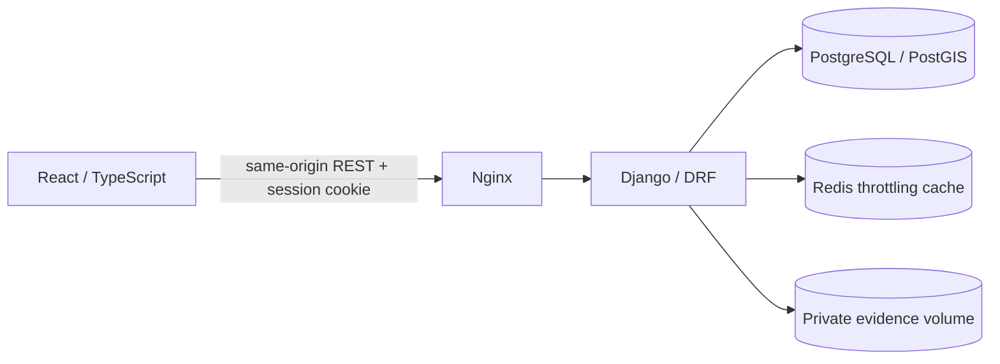

# GDA — Environmental Reporting Platform

GDA is a modernisation of an environmental reporting final-year project. Citizens can file and follow reports; operators can review them and record status changes; administrators can manage account roles. Anonymous reporters receive a private access code instead of creating an account.

This repository is a **new implementation with a clean history**. It does not import commits, the database dump, credentials, personal records or cached artifacts from [`gda_visual`](https://github.com/ricard00liveira/gda_visual) and [`gda_heroku`](https://github.com/ricard00liveira/gda_heroku). The supplied audit was used as a risk reference. [Legacy migration status](docs/legacy-migration.md) records what was verified and what remains unresolved.

## What works

- Django 5.2 / DRF API with role and object permissions, PostgreSQL/PostGIS points and UUID report IDs.
- Session authentication with `HttpOnly` cookies and CSRF for unsafe requests; no browser token storage.
- Authenticated and anonymous report submission, private evidence downloads, catalog lookup and paginated report lists.
- Explicit, transactional status transitions with actor and reason history.
- React 19 / TypeScript frontend with a responsive citizen journey, report panel and administrative role view.
- Docker Compose for PostGIS, Redis, API and static frontend; fixed dependency lockfiles and GitHub Actions checks.

The portfolio MVP deliberately excludes the legacy Gmail, OpenAI, AWS and IBGE integrations. None is safe to reuse until their credentials and data flows are reviewed. There is no public demo or production deployment configuration yet.

## Run locally

You need Docker with Compose. Copy `.env.example` to `.env`, replace `DJANGO_SECRET_KEY` with a fresh random value, and keep the file private. All values in the example are local-only placeholders.

```powershell
Copy-Item .env.example .env
# Edit DJANGO_SECRET_KEY in .env before starting.
docker compose up --build
```

Open <http://localhost:8080>. The API schema is available at <http://localhost:8080/api/schema/> and its UI at <http://localhost:8080/api/docs/>. Six generic categories are seeded by migration. Municipalities can be entered by an administrator later; location coordinates and address text are optional.

The first administrator is created explicitly inside the backend container. Django administration is available at <http://localhost:8080/admin/> for catalog and municipality management:

```powershell
docker compose exec backend python manage.py createsuperuser
```

No demo accounts or personal data are seeded. The local Compose configuration uses HTTP and `DJANGO_DEBUG=1`; production requires HTTPS, a new secret, trusted host/origin settings, managed evidence storage, backups and an abuse-control review.

## Architecture



`backend/accounts` handles identity and roles. `backend/reports` owns reports, access tokens, evidence and status transitions. The frontend calls a small typed API client. [Authorization matrix](docs/authorization.md) and [security notes](SECURITY.md) describe the boundaries.

## Validate

GitHub Actions runs backend checks and risk-focused tests against a disposable PostGIS service, plus frontend lint, test, TypeScript build, dependency audit and secret scanning. A `v*` tag publishes the two images to GHCR only when those jobs pass; it does not deploy them to a live site.

```bash
cd frontend
npm ci
npm run lint && npm run test && npm run build

cd ../backend
python -m pip install -r requirements-dev.lock
ruff check . && ruff format --check .
python manage.py check
pytest -q
```

Backend checks require GDAL/GEOS and backend tests require a disposable PostGIS database. The isolated local Compose project started successfully and all 13 backend tests passed against its fresh PostGIS database. GitHub Actions has not run because the clean repository has not been pushed. [Validation log](docs/validation.md) distinguishes completed checks from pending ones.

## Project origin

The original GDA was built as a final-year project. This iteration keeps the domain and core technology choices while rebuilding the authorization, data model and interface from a clean starting point. The old repositories are still publicly accessible; their exposure and fork require owner-led remediation before any history rewrite or promotion of a public demo.
