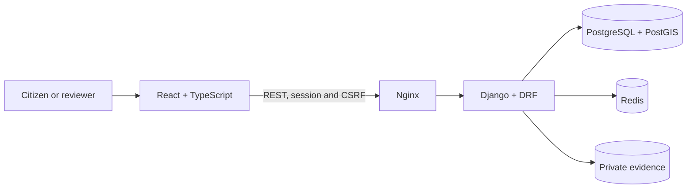

# GDA — Environmental Reporting Platform

**A web platform for submitting, tracking and reviewing environmental reports.**

GDA (Gerenciador de Denúncias Ambientais) is a **modernisation of my university final-year project**. It began as a way to make environmental concerns easier to report and has been rebuilt as a full-stack application with a clear citizen journey and a dedicated workspace for the teams reviewing cases.

This iteration keeps the academic project's core purpose and technology choices while updating the user experience, architecture, security and development workflow.

**Django + DRF** · **React + TypeScript** · **PostgreSQL + PostGIS** · **Redis** · **Docker Compose** · **GitHub Actions**

## How it works

1. **Submit a report:** describe the issue, choose a category and optionally add a municipality, address and coordinates.
2. **Follow its progress:** signed-in citizens see their reports in a personal dashboard. Anonymous reporters receive a private access code to revisit their case.
3. **Review the case:** operators can see reports, access authorised evidence and record status changes with a history of decisions.
4. **Manage the platform:** administrators manage user roles and the catalogues used when creating reports.

Images and PDFs can be attached as evidence. Files remain private, and downloads are subject to the same access rules as their reports.

## Technology stack

| Layer | Technologies | What they do |
| --- | --- | --- |
| Frontend | React 19, TypeScript, Vite, React Router, TanStack Query | Forms, report dashboard, navigation and API communication |
| Backend | Python 3.12, Django 5.2, Django REST Framework | Business rules, authentication, permissions and REST endpoints |
| Geospatial data | PostgreSQL, PostGIS, GeoDjango | Report storage and geographic point data |
| Infrastructure | Docker Compose, Nginx, Gunicorn, Redis | Local services, frontend delivery, API serving and request throttling |
| Quality | Pytest, Vitest, Ruff, ESLint, Prettier, GitHub Actions | Tests, static checks, formatting and automated validation |

## Engineering highlights

- **Role-based and report-level authorisation:** citizens, operators and administrators have different capabilities. Access to an individual report or attachment also depends on ownership or a valid anonymous access code.
- **Protected sessions:** authentication uses `HttpOnly` cookies and CSRF protection for state-changing requests. The frontend does not store session tokens in `localStorage`.
- **Auditable status workflow:** allowed transitions are checked and recorded with an actor, reason and timestamp inside a database transaction.
- **Geospatial foundations:** optional coordinates are stored in a PostGIS `PointField`, providing a basis for future geographic queries and visualisations.
- **Reproducible local setup:** the frontend, API, spatial database and Redis run together through Docker Compose with pinned dependencies and health checks.

## Architecture



The monorepository separates `frontend/` from `backend/`. Within the backend, `accounts/` handles identity and roles, while `reports/` handles reports, evidence and status transitions.

## Run locally

With Docker and Docker Compose installed, create a `.env` file from [`.env.example`](.env.example), set a fresh `DJANGO_SECRET_KEY` and start the services:

```powershell
Copy-Item .env.example .env
# Replace DJANGO_SECRET_KEY with a random value in .env.
docker compose up --build -d
```

The interface is available at **http://localhost:8080** and the interactive API documentation at **http://localhost:8080/api/docs/**. Create the first administrator account with:

```powershell
docker compose exec backend python manage.py createsuperuser
```

GDA is a **portfolio MVP**. The local environment uses HTTP; a public deployment requires HTTPS and production infrastructure. The [validation log](docs/validation.md) records 13 backend tests run against an isolated PostGIS database, as well as frontend build, lint and test checks.
