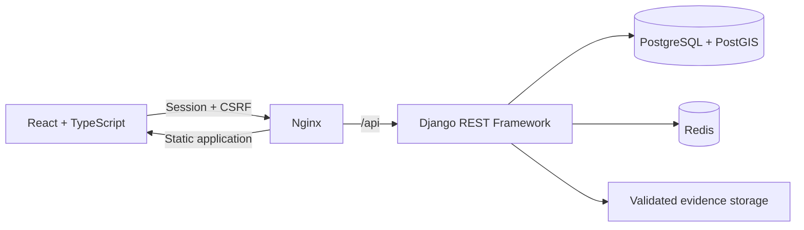

# GDA — Environmental Reporting Platform

[](https://github.com/ricardoportoIE/gda-environmental-reporting-platform/actions/workflows/ci.yml)
[](https://github.com/ricardoportoIE/gda-environmental-reporting-platform/releases)
[](LICENSE)

**A full-stack platform for submitting, tracking and reviewing environmental reports.**

GDA (_Gerenciador de Denúncias Ambientais_) is a modernisation of my final-year university project. The original academic concept has been rebuilt as a clean monorepo that demonstrates secure web engineering, geospatial data processing, automated quality gates and containerised delivery.

Residents can report environmental incidents and follow their progress, while authorised teams receive a dedicated workspace for assessment, evidence review and auditable status management.

The product interface is currently in Brazilian Portuguese. The source code, documentation and engineering conventions are maintained in English.

## Project at a glance

| Area       | Implementation                                                                                                                  |
| ---------- | ------------------------------------------------------------------------------------------------------------------------------- |
| Product    | Public and authenticated reporting, private reference-code tracking, evidence uploads and staff case management                 |
| Security   | Session authentication, CSRF protection, role-based access control, object-level authorisation and hardened production settings |
| Geospatial | PostGIS-backed coordinates, interactive mapping and nearby-report queries                                                       |
| Delivery   | Multi-stage containers, Docker Compose, health checks, GitHub Actions and versioned releases                                    |
| Quality    | Django, API, React, accessibility and end-to-end tests with enforced coverage thresholds                                        |

## Product capabilities

| User                | Capabilities                                                                            |
| ------------------- | --------------------------------------------------------------------------------------- |
| Anonymous reporter  | Submit a report and receive a private reference code for later tracking                 |
| Registered resident | Create reports, upload evidence and follow cases from a personal dashboard              |
| Operator            | Review authorised cases, inspect nearby reports and apply controlled status transitions |
| Administrator       | Manage users, roles and reporting catalogues through Django administration              |

Evidence files are validated by type and size. Report history records status changes, timestamps and the responsible actor, providing an audit trail for operational review.

## Engineering highlights

- **Defence in depth:** server-side permission classes and object-level checks protect report data independently of the user interface.
- **Safe browser authentication:** Django sessions and CSRF tokens are used consistently by the typed frontend HTTP client.
- **Controlled workflow:** explicit state transitions prevent invalid case updates and preserve an auditable history.
- **Useful spatial data:** PostGIS supports coordinate storage, an interactive Leaflet map and radius-based nearby-report searches.
- **Operational visibility:** structured JSON request logs, correlation IDs, liveness and dependency-aware readiness endpoints support diagnosis.
- **Production-aware configuration:** environment-specific Django settings fail closed when required secrets or trusted origins are missing.
- **Efficient frontend delivery:** route-level code splitting keeps the initial application bundle focused.

## Architecture



The frontend and backend live in one repository and share a single validation and release workflow. Nginx serves the production frontend and proxies API, administration, static and media requests to Django.

```text
.
├── backend/                 Django, DRF, domain logic and API tests
├── frontend/                React, TypeScript, Vitest and Playwright
├── docs/                    Deployment and validation guidance
├── nginx/                   Reverse-proxy configuration
├── .github/workflows/       Continuous integration and release automation
└── docker-compose.yml       Local full-stack environment
```

## Technology stack

| Layer          | Technologies                                                                          |
| -------------- | ------------------------------------------------------------------------------------- |
| Frontend       | React, TypeScript, Vite, React Router, TanStack Query, Leaflet, Lucide React          |
| Backend        | Python, Django, Django REST Framework, drf-spectacular                                |
| Data           | PostgreSQL, PostGIS, Redis                                                            |
| Infrastructure | Docker Compose, Nginx, Gunicorn, GitHub Actions, GHCR                                 |
| Quality        | Pytest, pytest-cov, MyPy, Vitest, Testing Library, Playwright, axe-core, Ruff, ESLint |

## Quality and verification

The current release has been verified with the following automated checks:

| Suite               | Result                                                             |
| ------------------- | ------------------------------------------------------------------ |
| Backend             | 21 tests passing; 87.38% statement coverage                        |
| Frontend            | 28 tests passing; 72.28% line coverage                             |
| End-to-end          | 3 Playwright journeys passing, including a WCAG accessibility scan |
| Contracts and types | OpenAPI schema generation, TypeScript and MyPy checks passing      |
| Security            | Dependency audit and repository secret scan passing                |

GitHub Actions repeats linting, type checks, tests, coverage enforcement, container builds, end-to-end journeys and security scans on every relevant change.

## Run locally

### Requirements

- Docker Engine or Docker Desktop
- Docker Compose v2

### 1. Create the local environment file

On macOS or Linux:

```bash
cp .env.example .env
```

On Windows PowerShell:

```powershell
Copy-Item .env.example .env
```

Replace the example secret and database values in `.env` before starting the application. Do not use production credentials locally or commit the file.

### 2. Start the platform

```bash
docker compose up --build -d
```

| Resource          | Address                           |
| ----------------- | --------------------------------- |
| Web application   | <http://localhost:8080>           |
| API documentation | <http://localhost:8080/api/docs/> |
| Liveness check    | <http://localhost:8080/health/>   |
| Readiness check   | <http://localhost:8080/ready/>    |

### 3. Create an administrator

```bash
docker compose exec backend python manage.py createsuperuser
```

### 4. Add synthetic demonstration data

Preview the operation first, then create the records:

```bash
docker compose exec backend python manage.py seed_demo_data --dry-run
docker compose exec backend python manage.py seed_demo_data
```

The seed command is idempotent and uses synthetic content intended only for local demonstration.

## Run checks manually

Backend checks run inside the project container:

```bash
docker compose run --rm --user root backend sh -c "pip install -r requirements-dev.lock && ruff check . && mypy accounts reports config && python manage.py spectacular --file /tmp/schema.yml --validate --fail-on-warn && pytest --cov=accounts --cov=reports --cov-branch --cov-report=term-missing --cov-fail-under=80"
```

Frontend checks run from the frontend directory:

```bash
cd frontend
npm ci
npm run lint
npm run build
npm run coverage
npm run test:e2e
```

## Documentation

- [Deployment guide](docs/DEPLOYMENT.md)
- [Validation record](docs/VALIDATION.md)
- [Contribution guide](CONTRIBUTING.md)
- [Security policy](SECURITY.md)
- [Release history](CHANGELOG.md)

## Project status

GDA is a portfolio-grade engineering case study and runnable MVP. The repository is suitable for local evaluation and continuous integration. A public production deployment still requires managed infrastructure, HTTPS, durable object storage, monitoring and environment-specific secrets, as described in the deployment guide.

The current stable version is [v2.0.0](https://github.com/ricardoportoIE/gda-environmental-reporting-platform/releases/tag/v2.0.0).

## Licence

This project is available under the [MIT Licence](LICENSE).
